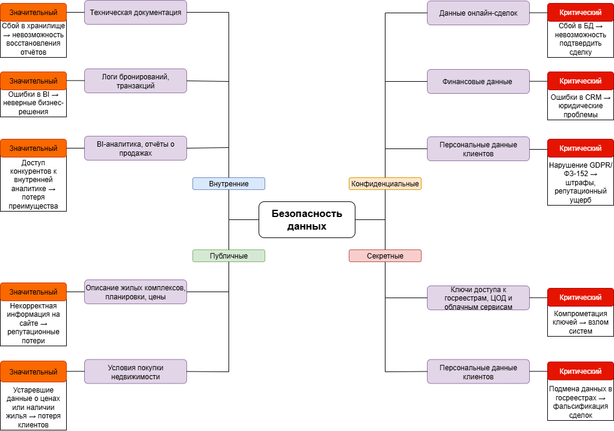

| Категория данных       | Пример данных                                                                         | Риск                                                         | Оценка риска | Пояснение                                                       |
|------------------------|---------------------------------------------------------------------------------------|--------------------------------------------------------------|--------------|-----------------------------------------------------------------|
| **1.Публичные**        | Описание жилых комплексов, планировки, цены                                           | Искажение (некорректная информация)                          | Значительный | Некорректная информация на сайте → репутационные потери         |
|                        | Условия покупки недвижимости                                                          | Обесценивание (устаревшие данные)                            | Значительный | Устаревшие данные о ценах или наличии жилья → потеря клиентов   |
| **2.Внутренние**       | BI-аналитика, отчёты о продажах                                                       | Утечка (доступ конкурентов)                                  | Значительный | Доступ конкурентов к внутренней аналитике → потеря преимущества |
|                        | Логи бронирований, транзакций                                                         | Потеря (сбой хранилища)                                      | Значительный | Сбой в хранилище → невозможность восстановления отчётов         |
|                        | Техническая документация (архитектура, CI/CD)                                         | Некачественные данные (ошибки в отчётах)                     | Значительный | Ошибки в BI → неверные бизнес-решения                           |
| **3.Конфиденциальные** | Персональные данные клиентов (ФИО, контакты, паспортные данные)                       | Утечка (нарушение GDPR/ФЗ-152)                               | Критический  | Нарушение GDPR/ФЗ-152 → штрафы, репутационный ущерб             |
|                        | Финансовые данные (реквизиты сделок, платёжные данные)                                | Искажение (ошибки в CRM → юридические проблемы)              | Критический  | Ошибки в CRM → юридические проблемы                             |
|                        | Данные онлайн-сделок (договоры, интеграция с госорганами)                             | Потеря (сбой БД → невозможность подтвердить сделку).         | Критический  | Сбой в БД → невозможность подтвердить сделку                    |
| **4.Секретные**        | Ключи доступа к госреестрам (интеграция с ЕГРН, Росреестром), ЦОД и облачным сервисам | Утечка (компрометация ключей → взлом систем)                 | Критический  | Компрометация ключей → взлом систем                             |
|                        | Криптографические ключи (шифрование платежей)                                         | Искажение (подмена данных в реестрах → фальсификация сделок) | Критический  | Подмена данных в госреестрах → фальсификация сделок             |

Mind map данных:

