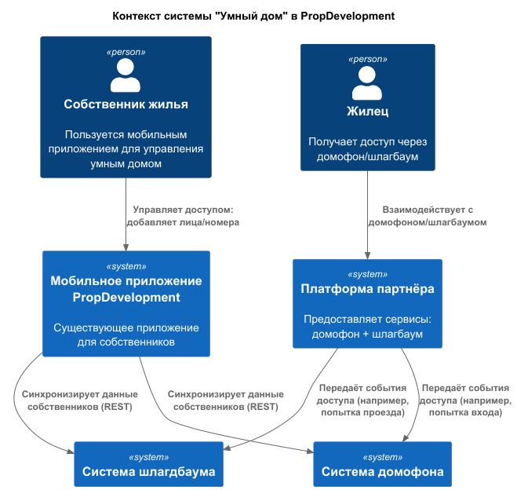

Диаграмма контекста в модели С4

[contextDiagram.puml](contextDiagram.puml)

Обновленная схема

[PropDevelopment_С4_model_new.drawio](PropDevelopment_%D0%A14_model_new.drawio)

## Требования к внешним интеграциям
# Безопасность
**1. Шифрование данных:**

- TLS 1.2+ для всех API-вызовов.
- Шифрование биометрических шаблонов (AES-256) при хранении в БД.

**2. Защита от атак:**

- Rate-limiting (не более 10 запросов/сек с одного устройства).
- Фильтрация SQL-инъекций в запросах к БД.

**3.Соглашение NDA с партнёром:**

- Запрет на хранение/передачу данных третьим лицам.

# Аутентификация и авторизация
**1. Протоколы:**

- OAuth 2.0 для доступа мобильного приложения к УмныйДом-Интегратор.
- API-ключи для взаимодействия с платформой партнёра (JWT с ограниченным сроком жизни).

**2. Роли:**

- Собственник: может добавлять/удалять лица и номера.
- Жилец: только доступ по биометрии/номерам.

