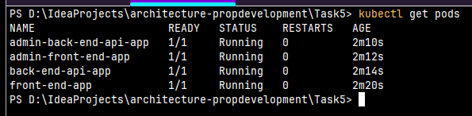

## Задание 5

Выполняются скрипты:
```shell
kubectl run front-end-app --image=nginx --labels role=front-end --expose --port 80
```
```shell
kubectl run back-end-api-app --image=nginx --labels role=back-end-api --expose --port 80
```
```shell
kubectl run admin-front-end-app --image=nginx --labels role=admin-front-end --expose --port 80
```
```shell
kubectl run admin-back-end-api-app --image=nginx --labels role=admin-back-end-api --expose --port 80
```
Проверка, что ПЛДы работают:
```shell
kubectl get pods
```
Результат:


Применяем сетевую политику
```shell
kubectl apply -f non-admin-api-allow.yaml
```

